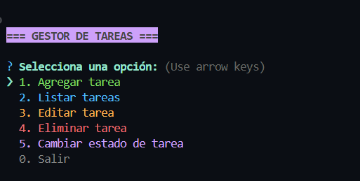

# 📝 Gestor de Tareas CLI

Una aplicación de consola creada con **Node.js**, que te permite gestionar tareas de forma rápida y visual. Ideal para practicar JavaScript, modularización, manipulación de archivos y una interfaz amigable con `Inquirer` y `Chalk`.

---

## 🚀 Características

- Agregar tareas con descripción.
- Listar todas las tareas.
- Editar una tarea existente.
- Eliminar tareas.
- Marcar tareas como completadas o no completadas.
- Persistencia local en archivos `.json`.
- Interfaz visual con colores gracias a `chalk`.

---

## 📸 Vista previa



---

## 📦 Tecnologías utilizadas

- [Inquirer](https://www.npmjs.com/package/inquirer)
- [Chalk](https://www.npmjs.com/package/chalk)
- [Lodash](https://lodash.com/)

---

## ⚙️ Instalación

Instala las dependencias:

```bash
npm install
```

Ejecuta el programa:

```bash
node index.js
```

## 🧩 Estructura del proyecto
``` pgsql
├── controllers/
│   └── tareasController.js
├── data/
│   └── tareas.json
├── helpers/
│   └── menu.js
├── utils/
│   └── archivo.js
├── index.js
└── README.md
```

## 📁 Datos persistentes
Las tareas se almacenan en ./data/tareas.json, permitiendo conservar tu progreso entre sesiones.

## 💡 Créditos
Julián Ortega